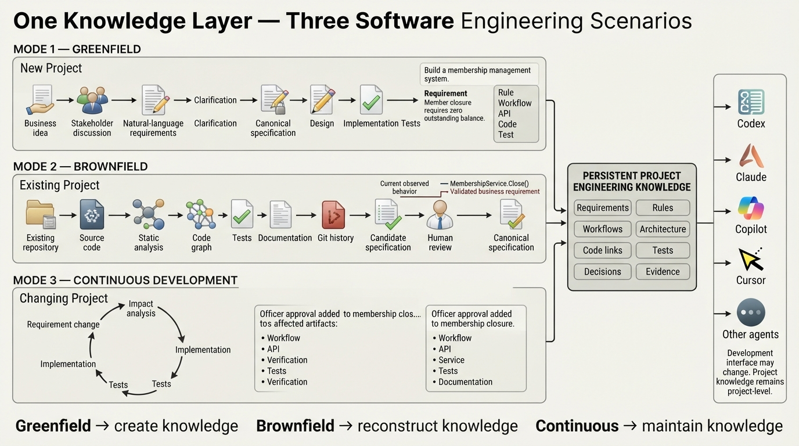
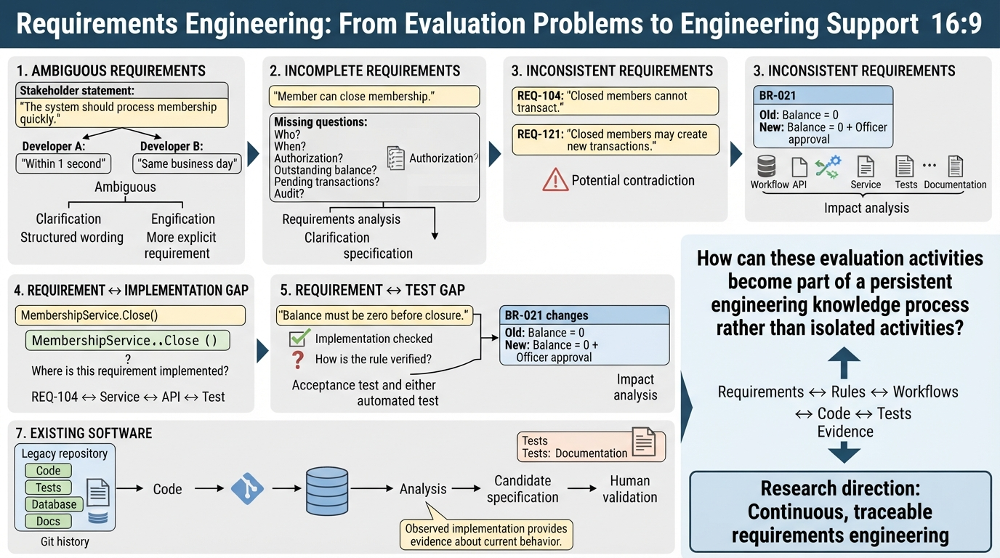
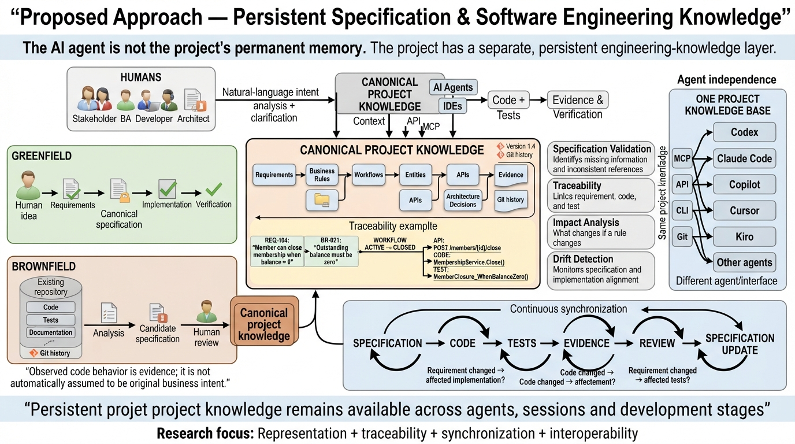
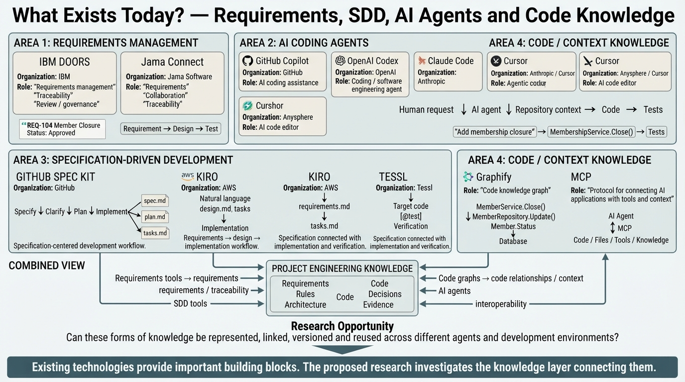
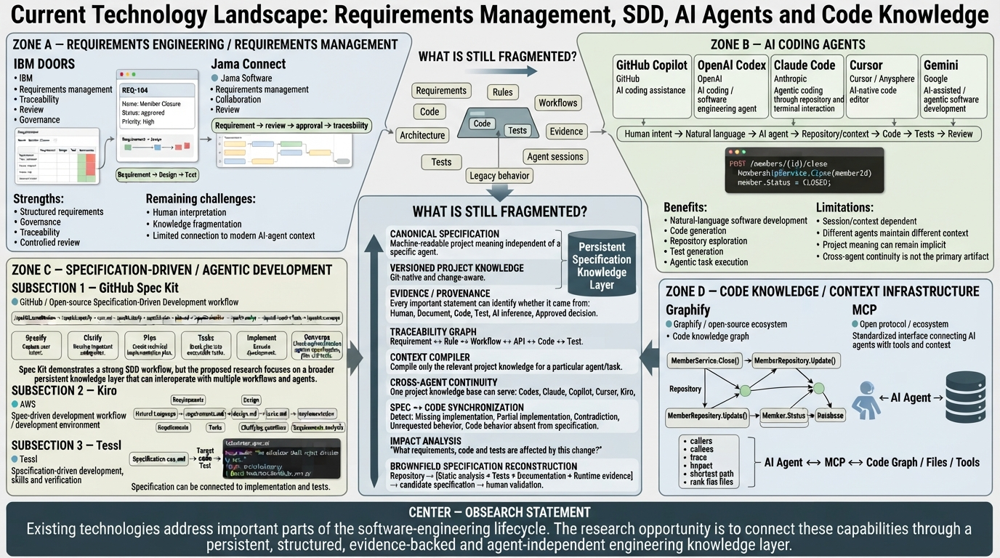
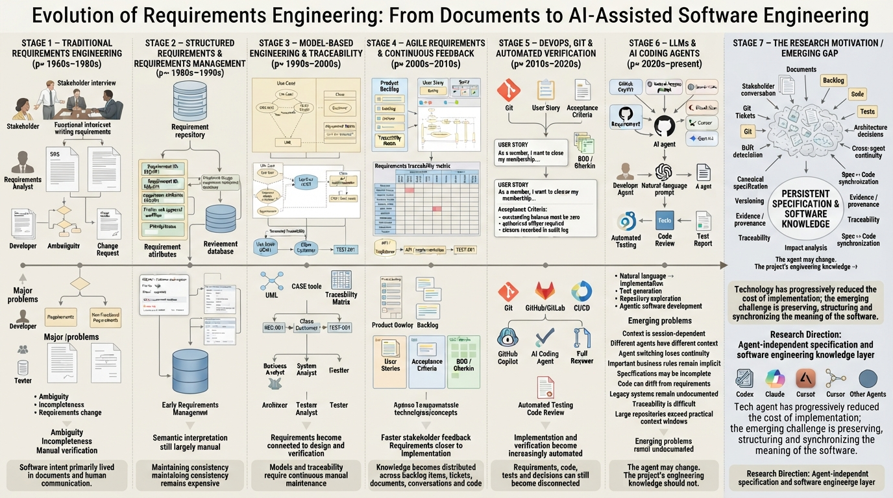
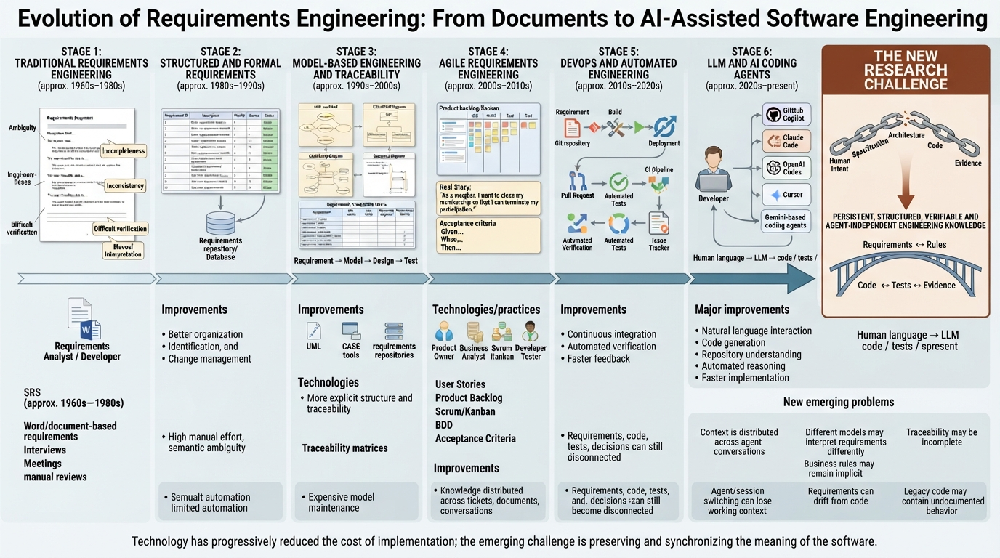
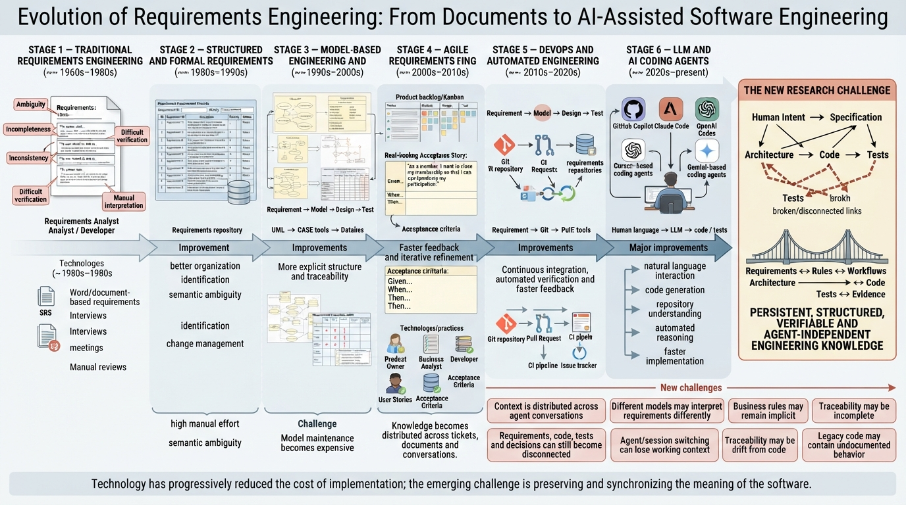
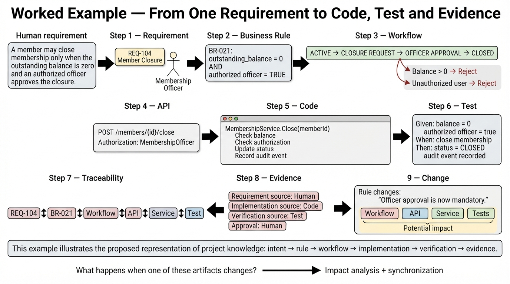

# SpecCraft: Keeping Project Knowledge Connected



## Abstract

Software teams have improved the way they capture requirements, model systems, ship changes, and run tests. The knowledge behind those activities is still spread across documents, tickets, chat, source code, tests, and Git history.

SpecCraft is a proposal for a project-level knowledge layer that connects those sources. It is not another coding assistant. It is a structured place for requirements, rules, workflows, decisions, code links, tests, and evidence. Editors, command-line tools, and assistants can use the same project knowledge without each keeping a separate version.

This article explains the problem, the proposed architecture, the evaluation plan, and a practical first implementation.

## 1. Why requirements keep getting lost

Requirements engineering has moved through several useful forms:

1. Documents and meetings captured intent.
2. Structured requirement systems added identifiers, status, and versioning.
3. Models and traceability connected requirements to design, code, and tests.
4. Agile and BDD brought requirements closer to acceptance criteria and executable examples.
5. DevOps connected changes, reviews, builds, and deployments.
6. Coding assistants made repository changes faster, but added another place where project knowledge can disappear: the agent session.

Each step solved part of the problem. None made the whole project meaning automatically durable.

The same requirement may now exist in a ticket, a design note, a pull request, a test, a code comment, and several conversations. These sources may disagree. A new team member or a new assistant has to reconstruct the connection each time.



## 2. What already exists

Requirements platforms manage structured requirements and traceability. Coding assistants can inspect repositories and change code. Specification-driven development tools provide workflows for moving from a request to a plan, tasks, implementation, and convergence.

These tools are useful, but they solve different parts of the problem:

- A requirements platform is not usually the working context for a coding assistant.
- A coding assistant's memory is tied to a session, model, or editor.
- A workflow tool does not necessarily reconstruct the intended specification of an existing system.
- A code graph describes relationships in code but does not explain why a rule exists.

SpecCraft should work underneath these tools rather than replace them. Its job is to keep the project knowledge stable while the tools change.

## 3. The proposed knowledge layer

The central design decision is simple:

> Project knowledge must live independently from the assistant that happens to use it.

The knowledge layer should hold:

- Requirements
- Business rules
- Workflows and state transitions
- API contracts
- Security and authorization rules
- Architecture decisions
- Code symbols and relationships
- Tests
- Evidence and provenance
- Findings, approvals, and review history



The useful unit is not an isolated requirement. It is a connected chain:

```text
Requirement → Rule → Workflow → API → Code → Test → Evidence
```

Every link should say where it came from, how confident it is, and whether a person has approved it.

### Provenance is not optional

Observed behavior is not automatically business intent. A rule inferred from code must not silently become an approved requirement.

Each item should therefore distinguish between:

- Human-provided intent
- Documentation evidence
- Code-observed behavior
- Test evidence
- Git history
- Assistant-generated inference

Inferred items should carry a confidence level and a review state such as `candidate`, `needs-review`, or `approved`.

## 4. The problems SpecCraft should evaluate

The system should report findings, not pretend that uncertain conclusions are facts.

### Ambiguity

Words such as “quickly”, “normally”, or “authorized” need a measurable meaning. The system can flag the wording and ask a person to clarify it.

### Incompleteness

A request such as “close a membership” may not say who can do it, what happens to outstanding transactions, whether the membership can be reopened, or what must be recorded.

### Contradiction

Two requirements may appear to conflict but apply to different roles, states, or versions. SpecCraft should show the evidence and ask for a human decision. It should not choose the winning requirement.

### Missing links

An approved requirement without a code link or test link is a useful warning. It is not proof that the requirement is unimplemented.

### Change impact

When a rule changes, the system should identify candidate downstream changes in workflows, APIs, authorization, services, UI, tests, and documentation.



## 5. Greenfield, brownfield, and continuous work

The same model should support three situations.

### Greenfield

The team starts with requirements, rules, and decisions. Implementation links are added as the system is built.

### Brownfield

The system starts with code, tests, database structures, APIs, documentation, and Git history. SpecCraft builds a candidate specification from those sources.

The result must be presented as reconstructed evidence, not as the original business intent. A person must validate it.

### Continuous development

Requirements, code, tests, and evidence change together. The system keeps links current and highlights stale or conflicting information.



## 6. Context compilation

Sending an entire repository to a tool is expensive and often unhelpful. SpecCraft should compile a task-specific context package.

For a membership-closure task, the package might contain:

- Requirement `REQ-104`
- Business rule `BR-021`
- Membership entity
- Closure workflow
- API contract
- Role and authorization rule
- Relevant source files
- Relevant tests
- Open findings and evidence

The compiler should be evaluated on three measures:

1. Relevance: does the package contain useful material?
2. Completeness: did it include the information needed for the task?
3. False inclusion: did it include unrelated or misleading material?



## 7. A practical MVP

The full vision includes repository-scale analysis, multiple adapters, and continuous synchronization. That is too broad for a first release.

The first version should use one vertical slice:

1. Enter a membership-closure requirement.
2. Store structured fields and evidence.
3. Add a business rule and workflow.
4. Link the API, source code, and tests.
5. Show unresolved ambiguity or missing links.
6. Change one rule.
7. Produce a candidate impact report.
8. Compile the context needed for the next implementation task.

This slice is small enough to evaluate and broad enough to demonstrate the product's main value.



Features that should wait:

- General-purpose workflow modeling
- Full repository code graphs
- Autonomous approval of inferred intent
- Production-scale database and Git-history reconstruction
- Support for every editor and assistant
- Fully automatic bidirectional synchronization

## 8. Evaluation plan

The project needs measurable baselines, not only a convincing demo.

For a small expert-created set of requirements, record expected findings for:

- Ambiguity
- Missing dimensions
- Contradictions
- Requirement-to-code links
- Requirement-to-test links
- Change impact
- Brownfield reconstruction
- Context selection

Compare SpecCraft's output with the expert baseline. Report precision, recall, false positives, false negatives, and reviewer effort. For inferred specifications, record whether the result was accepted, corrected, or rejected by the reviewer.



The system should also report uncertainty clearly. A plausible result is not the same as a verified result.

## 9. Architecture and boundaries

The implementation should keep the following boundaries clear:

- The canonical model owns project knowledge.
- Adapters translate external formats and tool requests.
- An analyzer produces findings with evidence.
- A context compiler selects task-relevant knowledge.
- A review workflow controls approval.
- Git remains the durable version history.

Spec Kit, Kiro, Tessl, Copilot, Claude, Codex, and other tools can be adapters or consumers. They should not own the project's only copy of its meaning.

Security must be designed before production use. Requirements, evidence, source code, and compiled context may contain sensitive information. Access control, redaction, source precedence, freshness, and conflict handling need explicit policies.

## 10. Conclusion

SpecCraft addresses a practical gap in modern development: the distance between what a team means, what the code does, and what tools know.

The strongest version of the idea is not “an AI that writes better specifications.” It is a shared project record with traceable evidence, human review, and useful task-specific context.

The right next step is a narrow, measurable vertical slice. If that slice can connect one requirement to one rule, workflow, API, implementation, test, and impact report, the broader product will have a solid foundation.


