# Community 1

> 44 nodes · cohesion 0.06

## Key Concepts

- [production-infrastructure.js](file:///C:/Users/HabiburRahmanShalin/workstation/shaleen/ApplicationDevelopment/spec-craft/src/production-infrastructure.js#L1) (23 connections)
- [ManagedDatabaseAdapter](file:///C:/Users/HabiburRahmanShalin/workstation/shaleen/ApplicationDevelopment/spec-craft/src/production-infrastructure.js#L613) (8 connections)
- [digest()](file:///C:/Users/HabiburRahmanShalin/workstation/shaleen/ApplicationDevelopment/spec-craft/src/production-infrastructure.js#L26) (6 connections)
- [decodeJsonWebToken()](file:///C:/Users/HabiburRahmanShalin/workstation/shaleen/ApplicationDevelopment/spec-craft/src/production-infrastructure.js#L37) (5 connections)
- [DurableAuditLog](file:///C:/Users/HabiburRahmanShalin/workstation/shaleen/ApplicationDevelopment/spec-craft/src/production-infrastructure.js#L107) (5 connections)
- [ManagedIdentityProvider](file:///C:/Users/HabiburRahmanShalin/workstation/shaleen/ApplicationDevelopment/spec-craft/src/production-infrastructure.js#L713) (5 connections)
- [.append()](file:///C:/Users/HabiburRahmanShalin/workstation/shaleen/ApplicationDevelopment/spec-craft/src/production-infrastructure.js#L112) (4 connections)
- [ISO()](file:///C:/Users/HabiburRahmanShalin/workstation/shaleen/ApplicationDevelopment/spec-craft/src/production-infrastructure.js#L13) (4 connections)
- [.loadJwks()](file:///C:/Users/HabiburRahmanShalin/workstation/shaleen/ApplicationDevelopment/spec-craft/src/production-infrastructure.js#L767) (4 connections)
- [.verifyToken()](file:///C:/Users/HabiburRahmanShalin/workstation/shaleen/ApplicationDevelopment/spec-craft/src/production-infrastructure.js#L831) (4 connections)
- [ManagedIdentityService](file:///C:/Users/HabiburRahmanShalin/workstation/shaleen/ApplicationDevelopment/spec-craft/src/production-infrastructure.js#L568) (4 connections)
- [.verifyToken()](file:///C:/Users/HabiburRahmanShalin/workstation/shaleen/ApplicationDevelopment/spec-craft/src/production-infrastructure.js#L579) (4 connections)
- [SecurityReviewRunner](file:///C:/Users/HabiburRahmanShalin/workstation/shaleen/ApplicationDevelopment/spec-craft/src/production-infrastructure.js#L1063) (4 connections)
- [createVerifiedPrincipal()](file:///C:/Users/HabiburRahmanShalin/workstation/shaleen/ApplicationDevelopment/spec-craft/src/production-infrastructure.js#L72) (3 connections)
- [.verify()](file:///C:/Users/HabiburRahmanShalin/workstation/shaleen/ApplicationDevelopment/spec-craft/src/production-infrastructure.js#L136) (3 connections)
- [ManagedAuthorizationService](file:///C:/Users/HabiburRahmanShalin/workstation/shaleen/ApplicationDevelopment/spec-craft/src/production-infrastructure.js#L874) (3 connections)
- [.createProject()](file:///C:/Users/HabiburRahmanShalin/workstation/shaleen/ApplicationDevelopment/spec-craft/src/production-infrastructure.js#L662) (3 connections)
- [.normalizeProject()](file:///C:/Users/HabiburRahmanShalin/workstation/shaleen/ApplicationDevelopment/spec-craft/src/production-infrastructure.js#L631) (3 connections)
- [Outbox](file:///C:/Users/HabiburRahmanShalin/workstation/shaleen/ApplicationDevelopment/spec-craft/src/production-infrastructure.js#L437) (3 connections)
- [verifyHmacJwt()](file:///C:/Users/HabiburRahmanShalin/workstation/shaleen/ApplicationDevelopment/spec-craft/src/production-infrastructure.js#L59) (3 connections)
- [safeTokenMatches()](file:///C:/Users/HabiburRahmanShalin/workstation/shaleen/ApplicationDevelopment/spec-craft/src/platform-http.js#L65) (2 connections)
- [base64UrlDecode()](file:///C:/Users/HabiburRahmanShalin/workstation/shaleen/ApplicationDevelopment/spec-craft/src/production-infrastructure.js#L30) (2 connections)
- [EnvironmentSecretManager](file:///C:/Users/HabiburRahmanShalin/workstation/shaleen/ApplicationDevelopment/spec-craft/src/production-infrastructure.js#L183) (2 connections)
- [EnvironmentSecretProvider](file:///C:/Users/HabiburRahmanShalin/workstation/shaleen/ApplicationDevelopment/spec-craft/src/production-infrastructure.js#L978) (2 connections)
- [.saveRevision()](file:///C:/Users/HabiburRahmanShalin/workstation/shaleen/ApplicationDevelopment/spec-craft/src/production-infrastructure.js#L675) (2 connections)
- *... and 19 more nodes in this community*

## Class Diagram

```mermaid
classDiagram
    class DurableAuditLog {
        +production-infrastructure.js()
        +.constructor()
        +.append()
        +.list()
        +.verify()
    }
    class EnvironmentSecretManager {
        +production-infrastructure.js()
        +.constructor()
    }
    class EnvironmentSecretProvider {
        +production-infrastructure.js()
        +.constructor()
    }
    class ManagedAuthorizationService {
        +production-infrastructure.js()
        +.constructor()
        +.authorize()
    }
    class ManagedDatabaseAdapter {
        +production-infrastructure.js()
        +.constructor()
        +.normalizeProject()
        +.migrationPlan()
        +.createProject()
        +.getProject()
        +.saveRevision()
        +.withTransaction()
    }
    class ManagedIdentityProvider {
        +production-infrastructure.js()
        +.constructor()
        +.validateConfiguration()
        +.loadJwks()
        +.verifyToken()
    }
    class ManagedIdentityService {
        +production-infrastructure.js()
        +.constructor()
        +.verifyToken()
        +.authorize()
    }
    class Outbox {
        +production-infrastructure.js()
        +.constructor()
        +.publish()
    }
    class SecurityReviewRunner {
        +production-infrastructure.js()
        +.constructor()
        +.scanText()
        +.scanFiles()
    }
```

## Relationships

- No strong cross-community connections detected

## Source Files

- [C:\Users\HabiburRahmanShalin\workstation\shaleen\ApplicationDevelopment\spec-craft\src\platform-http.js](file:///C:/Users/HabiburRahmanShalin/workstation/shaleen/ApplicationDevelopment/spec-craft/src/platform-http.js)
- [C:\Users\HabiburRahmanShalin\workstation\shaleen\ApplicationDevelopment\spec-craft\src\production-infrastructure.js](file:///C:/Users/HabiburRahmanShalin/workstation/shaleen/ApplicationDevelopment/spec-craft/src/production-infrastructure.js)

## Audit Trail

- EXTRACTED: 129 (96%)
- INFERRED: 5 (4%)
- AMBIGUOUS: 0 (0%)

---

*Part of the graphify knowledge wiki. See [[index]] to navigate.*