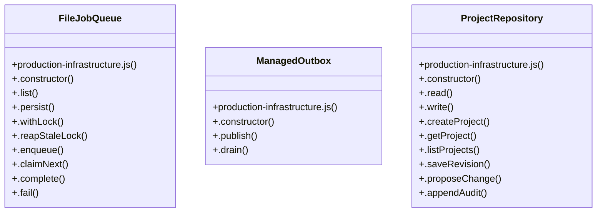

# Community 4

> 25 nodes · cohesion 0.13

## Key Concepts

- [.withLock()](file:///C:/Users/HabiburRahmanShalin/workstation/shaleen/ApplicationDevelopment/spec-craft/src/production-infrastructure.js#L247) (12 connections)
- [FileJobQueue](file:///C:/Users/HabiburRahmanShalin/workstation/shaleen/ApplicationDevelopment/spec-craft/src/production-infrastructure.js#L219) (10 connections)
- [ProjectRepository](file:///C:/Users/HabiburRahmanShalin/workstation/shaleen/ApplicationDevelopment/spec-craft/src/production-infrastructure.js#L447) (10 connections)
- [.drain()](file:///C:/Users/HabiburRahmanShalin/workstation/shaleen/ApplicationDevelopment/spec-craft/src/production-infrastructure.js#L1043) (5 connections)
- [.read()](file:///C:/Users/HabiburRahmanShalin/workstation/shaleen/ApplicationDevelopment/spec-craft/src/production-infrastructure.js#L453) (5 connections)
- [.enqueue()](file:///C:/Users/HabiburRahmanShalin/workstation/shaleen/ApplicationDevelopment/spec-craft/src/production-infrastructure.js#L361) (4 connections)
- [.list()](file:///C:/Users/HabiburRahmanShalin/workstation/shaleen/ApplicationDevelopment/spec-craft/src/production-infrastructure.js#L232) (4 connections)
- [ManagedOutbox](file:///C:/Users/HabiburRahmanShalin/workstation/shaleen/ApplicationDevelopment/spec-craft/src/production-infrastructure.js#L1034) (4 connections)
- [.claimNext()](file:///C:/Users/HabiburRahmanShalin/workstation/shaleen/ApplicationDevelopment/spec-craft/src/production-infrastructure.js#L376) (3 connections)
- [.complete()](file:///C:/Users/HabiburRahmanShalin/workstation/shaleen/ApplicationDevelopment/spec-craft/src/production-infrastructure.js#L397) (3 connections)
- [.fail()](file:///C:/Users/HabiburRahmanShalin/workstation/shaleen/ApplicationDevelopment/spec-craft/src/production-infrastructure.js#L416) (3 connections)
- [.reapStaleLock()](file:///C:/Users/HabiburRahmanShalin/workstation/shaleen/ApplicationDevelopment/spec-craft/src/production-infrastructure.js#L291) (3 connections)
- [persistAtomically()](file:///C:/Users/HabiburRahmanShalin/workstation/shaleen/ApplicationDevelopment/spec-craft/src/production-infrastructure.js#L15) (3 connections)
- [.persist()](file:///C:/Users/HabiburRahmanShalin/workstation/shaleen/ApplicationDevelopment/spec-craft/src/production-infrastructure.js#L242) (2 connections)
- [.publish()](file:///C:/Users/HabiburRahmanShalin/workstation/shaleen/ApplicationDevelopment/spec-craft/src/production-infrastructure.js#L1039) (2 connections)
- [.appendAudit()](file:///C:/Users/HabiburRahmanShalin/workstation/shaleen/ApplicationDevelopment/spec-craft/src/production-infrastructure.js#L550) (2 connections)
- [.createProject()](file:///C:/Users/HabiburRahmanShalin/workstation/shaleen/ApplicationDevelopment/spec-craft/src/production-infrastructure.js#L472) (2 connections)
- [.getProject()](file:///C:/Users/HabiburRahmanShalin/workstation/shaleen/ApplicationDevelopment/spec-craft/src/production-infrastructure.js#L498) (2 connections)
- [.listProjects()](file:///C:/Users/HabiburRahmanShalin/workstation/shaleen/ApplicationDevelopment/spec-craft/src/production-infrastructure.js#L503) (2 connections)
- [.proposeChange()](file:///C:/Users/HabiburRahmanShalin/workstation/shaleen/ApplicationDevelopment/spec-craft/src/production-infrastructure.js#L528) (2 connections)
- [.saveRevision()](file:///C:/Users/HabiburRahmanShalin/workstation/shaleen/ApplicationDevelopment/spec-craft/src/production-infrastructure.js#L508) (2 connections)
- [.write()](file:///C:/Users/HabiburRahmanShalin/workstation/shaleen/ApplicationDevelopment/spec-craft/src/production-infrastructure.js#L468) (2 connections)
- [.constructor()](file:///C:/Users/HabiburRahmanShalin/workstation/shaleen/ApplicationDevelopment/spec-craft/src/production-infrastructure.js#L220) (1 connections)
- [.constructor()](file:///C:/Users/HabiburRahmanShalin/workstation/shaleen/ApplicationDevelopment/spec-craft/src/production-infrastructure.js#L1035) (1 connections)
- [.constructor()](file:///C:/Users/HabiburRahmanShalin/workstation/shaleen/ApplicationDevelopment/spec-craft/src/production-infrastructure.js#L448) (1 connections)

## Class Diagram

## Relationships

- No strong cross-community connections detected

## Source Files

- [C:\Users\HabiburRahmanShalin\workstation\shaleen\ApplicationDevelopment\spec-craft\src\production-infrastructure.js](file:///C:/Users/HabiburRahmanShalin/workstation/shaleen/ApplicationDevelopment/spec-craft/src/production-infrastructure.js)

## Audit Trail

- EXTRACTED: 87 (97%)
- INFERRED: 3 (3%)
- AMBIGUOUS: 0 (0%)

---

*Part of the graphify knowledge wiki. See [[index]] to navigate.*