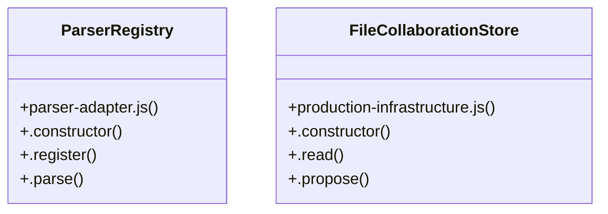

# Community 6

> 22 nodes · cohesion 0.13

## Key Concepts

- [.parse()](file:///C:/Users/HabiburRahmanShalin/workstation/shaleen/ApplicationDevelopment/spec-craft/src/parser-adapter.js#L224) (12 connections)
- [parser-adapter.js](file:///C:/Users/HabiburRahmanShalin/workstation/shaleen/ApplicationDevelopment/spec-craft/src/parser-adapter.js#L1) (7 connections)
- [buildCodeGraph()](file:///C:/Users/HabiburRahmanShalin/workstation/shaleen/ApplicationDevelopment/spec-craft/src/code-graph.js#L29) (7 connections)
- [code-graph.js](file:///C:/Users/HabiburRahmanShalin/workstation/shaleen/ApplicationDevelopment/spec-craft/src/code-graph.js#L1) (6 connections)
- [commonResult()](file:///C:/Users/HabiburRahmanShalin/workstation/shaleen/ApplicationDevelopment/spec-craft/src/parser-adapter.js#L3) (4 connections)
- [ParserRegistry](file:///C:/Users/HabiburRahmanShalin/workstation/shaleen/ApplicationDevelopment/spec-craft/src/parser-adapter.js#L213) (4 connections)
- [FileCollaborationStore](file:///C:/Users/HabiburRahmanShalin/workstation/shaleen/ApplicationDevelopment/spec-craft/src/production-infrastructure.js#L189) (4 connections)
- [.register()](file:///C:/Users/HabiburRahmanShalin/workstation/shaleen/ApplicationDevelopment/spec-craft/src/parser-adapter.js#L218) (3 connections)
- [extractSymbols()](file:///C:/Users/HabiburRahmanShalin/workstation/shaleen/ApplicationDevelopment/spec-craft/src/code-graph.js#L25) (2 connections)
- [isTestFile()](file:///C:/Users/HabiburRahmanShalin/workstation/shaleen/ApplicationDevelopment/spec-craft/src/code-graph.js#L4) (2 connections)
- [moduleNodeId()](file:///C:/Users/HabiburRahmanShalin/workstation/shaleen/ApplicationDevelopment/spec-craft/src/code-graph.js#L8) (2 connections)
- [resolveScannedImport()](file:///C:/Users/HabiburRahmanShalin/workstation/shaleen/ApplicationDevelopment/spec-craft/src/code-graph.js#L14) (2 connections)
- [createDefaultParserRegistry()](file:///C:/Users/HabiburRahmanShalin/workstation/shaleen/ApplicationDevelopment/spec-craft/src/parser-adapter.js#L246) (2 connections)
- [parseJavaScriptSource()](file:///C:/Users/HabiburRahmanShalin/workstation/shaleen/ApplicationDevelopment/spec-craft/src/parser-adapter.js#L33) (2 connections)
- [parsePythonSource()](file:///C:/Users/HabiburRahmanShalin/workstation/shaleen/ApplicationDevelopment/spec-craft/src/parser-adapter.js#L171) (2 connections)
- [.propose()](file:///C:/Users/HabiburRahmanShalin/workstation/shaleen/ApplicationDevelopment/spec-craft/src/production-infrastructure.js#L204) (2 connections)
- [.read()](file:///C:/Users/HabiburRahmanShalin/workstation/shaleen/ApplicationDevelopment/spec-craft/src/production-infrastructure.js#L195) (2 connections)
- [sourceExtensions](file:///C:/Users/HabiburRahmanShalin/workstation/shaleen/ApplicationDevelopment/spec-craft/src/code-graph.js#L12) (1 connections)
- [declarationNames()](file:///C:/Users/HabiburRahmanShalin/workstation/shaleen/ApplicationDevelopment/spec-craft/src/parser-adapter.js#L25) (1 connections)
- [identifierName()](file:///C:/Users/HabiburRahmanShalin/workstation/shaleen/ApplicationDevelopment/spec-craft/src/parser-adapter.js#L13) (1 connections)
- [.constructor()](file:///C:/Users/HabiburRahmanShalin/workstation/shaleen/ApplicationDevelopment/spec-craft/src/parser-adapter.js#L214) (1 connections)
- [.constructor()](file:///C:/Users/HabiburRahmanShalin/workstation/shaleen/ApplicationDevelopment/spec-craft/src/production-infrastructure.js#L190) (1 connections)

## Class Diagram

## Relationships

- No strong cross-community connections detected

## Source Files

- [C:\Users\HabiburRahmanShalin\workstation\shaleen\ApplicationDevelopment\spec-craft\src\code-graph.js](file:///C:/Users/HabiburRahmanShalin/workstation/shaleen/ApplicationDevelopment/spec-craft/src/code-graph.js)
- [C:\Users\HabiburRahmanShalin\workstation\shaleen\ApplicationDevelopment\spec-craft\src\parser-adapter.js](file:///C:/Users/HabiburRahmanShalin/workstation/shaleen/ApplicationDevelopment/spec-craft/src/parser-adapter.js)
- [C:\Users\HabiburRahmanShalin\workstation\shaleen\ApplicationDevelopment\spec-craft\src\production-infrastructure.js](file:///C:/Users/HabiburRahmanShalin/workstation/shaleen/ApplicationDevelopment/spec-craft/src/production-infrastructure.js)

## Audit Trail

- EXTRACTED: 54 (77%)
- INFERRED: 16 (23%)
- AMBIGUOUS: 0 (0%)

---

*Part of the graphify knowledge wiki. See [[index]] to navigate.*