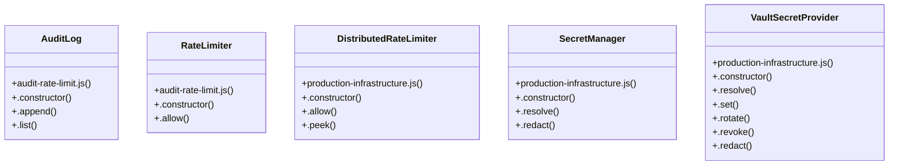

# Community 7

> 22 nodes · cohesion 0.10

## Key Concepts

- [.set()](file:///C:/Users/HabiburRahmanShalin/workstation/shaleen/ApplicationDevelopment/spec-craft/src/production-infrastructure.js#L941) (11 connections)
- [VaultSecretProvider](file:///C:/Users/HabiburRahmanShalin/workstation/shaleen/ApplicationDevelopment/spec-craft/src/production-infrastructure.js#L909) (7 connections)
- [AuditLog](file:///C:/Users/HabiburRahmanShalin/workstation/shaleen/ApplicationDevelopment/spec-craft/src/audit-rate-limit.js#L1) (4 connections)
- [DistributedRateLimiter](file:///C:/Users/HabiburRahmanShalin/workstation/shaleen/ApplicationDevelopment/spec-craft/src/production-infrastructure.js#L984) (4 connections)
- [SecretManager](file:///C:/Users/HabiburRahmanShalin/workstation/shaleen/ApplicationDevelopment/spec-craft/src/production-infrastructure.js#L147) (4 connections)
- [RateLimiter](file:///C:/Users/HabiburRahmanShalin/workstation/shaleen/ApplicationDevelopment/spec-craft/src/audit-rate-limit.js#L24) (3 connections)
- [.allow()](file:///C:/Users/HabiburRahmanShalin/workstation/shaleen/ApplicationDevelopment/spec-craft/src/audit-rate-limit.js#L37) (2 connections)
- [audit-rate-limit.js](file:///C:/Users/HabiburRahmanShalin/workstation/shaleen/ApplicationDevelopment/spec-craft/src/audit-rate-limit.js#L1) (2 connections)
- [.allow()](file:///C:/Users/HabiburRahmanShalin/workstation/shaleen/ApplicationDevelopment/spec-craft/src/production-infrastructure.js#L997) (2 connections)
- [.resolve()](file:///C:/Users/HabiburRahmanShalin/workstation/shaleen/ApplicationDevelopment/spec-craft/src/production-infrastructure.js#L154) (2 connections)
- [.rotate()](file:///C:/Users/HabiburRahmanShalin/workstation/shaleen/ApplicationDevelopment/spec-craft/src/production-infrastructure.js#L956) (2 connections)
- [.append()](file:///C:/Users/HabiburRahmanShalin/workstation/shaleen/ApplicationDevelopment/spec-craft/src/audit-rate-limit.js#L6) (1 connections)
- [.constructor()](file:///C:/Users/HabiburRahmanShalin/workstation/shaleen/ApplicationDevelopment/spec-craft/src/audit-rate-limit.js#L2) (1 connections)
- [.list()](file:///C:/Users/HabiburRahmanShalin/workstation/shaleen/ApplicationDevelopment/spec-craft/src/audit-rate-limit.js#L19) (1 connections)
- [.constructor()](file:///C:/Users/HabiburRahmanShalin/workstation/shaleen/ApplicationDevelopment/spec-craft/src/audit-rate-limit.js#L25) (1 connections)
- [.constructor()](file:///C:/Users/HabiburRahmanShalin/workstation/shaleen/ApplicationDevelopment/spec-craft/src/production-infrastructure.js#L985) (1 connections)
- [.peek()](file:///C:/Users/HabiburRahmanShalin/workstation/shaleen/ApplicationDevelopment/spec-craft/src/production-infrastructure.js#L1023) (1 connections)
- [.constructor()](file:///C:/Users/HabiburRahmanShalin/workstation/shaleen/ApplicationDevelopment/spec-craft/src/production-infrastructure.js#L148) (1 connections)
- [.redact()](file:///C:/Users/HabiburRahmanShalin/workstation/shaleen/ApplicationDevelopment/spec-craft/src/production-infrastructure.js#L178) (1 connections)
- [.constructor()](file:///C:/Users/HabiburRahmanShalin/workstation/shaleen/ApplicationDevelopment/spec-craft/src/production-infrastructure.js#L910) (1 connections)
- [.redact()](file:///C:/Users/HabiburRahmanShalin/workstation/shaleen/ApplicationDevelopment/spec-craft/src/production-infrastructure.js#L973) (1 connections)
- [.revoke()](file:///C:/Users/HabiburRahmanShalin/workstation/shaleen/ApplicationDevelopment/spec-craft/src/production-infrastructure.js#L960) (1 connections)

## Class Diagram

## Relationships

- No strong cross-community connections detected

## Source Files

- [C:\Users\HabiburRahmanShalin\workstation\shaleen\ApplicationDevelopment\spec-craft\src\audit-rate-limit.js](file:///C:/Users/HabiburRahmanShalin/workstation/shaleen/ApplicationDevelopment/spec-craft/src/audit-rate-limit.js)
- [C:\Users\HabiburRahmanShalin\workstation\shaleen\ApplicationDevelopment\spec-craft\src\production-infrastructure.js](file:///C:/Users/HabiburRahmanShalin/workstation/shaleen/ApplicationDevelopment/spec-craft/src/production-infrastructure.js)

## Audit Trail

- EXTRACTED: 48 (89%)
- INFERRED: 6 (11%)
- AMBIGUOUS: 0 (0%)

---

*Part of the graphify knowledge wiki. See [[index]] to navigate.*