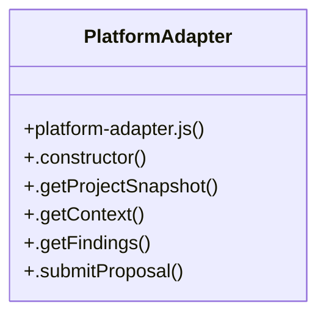

# Community 9

> 14 nodes · cohesion 0.14

## Key Concepts

- [spec-model.test.js](file:///C:/Users/HabiburRahmanShalin/workstation/shaleen/ApplicationDevelopment/spec-craft/test/spec-model.test.js#L1) (6 connections)
- [PlatformAdapter](file:///C:/Users/HabiburRahmanShalin/workstation/shaleen/ApplicationDevelopment/spec-craft/src/platform-adapter.js#L1) (6 connections)
- [.getContext()](file:///C:/Users/HabiburRahmanShalin/workstation/shaleen/ApplicationDevelopment/spec-craft/src/platform-adapter.js#L10) (2 connections)
- [context](file:///C:/Users/HabiburRahmanShalin/workstation/shaleen/ApplicationDevelopment/spec-craft/test/spec-model.test.js#L69) (2 connections)
- [platform-adapter.js](file:///C:/Users/HabiburRahmanShalin/workstation/shaleen/ApplicationDevelopment/spec-craft/src/platform-adapter.js#L1) (1 connections)
- [.constructor()](file:///C:/Users/HabiburRahmanShalin/workstation/shaleen/ApplicationDevelopment/spec-craft/src/platform-adapter.js#L2) (1 connections)
- [.getFindings()](file:///C:/Users/HabiburRahmanShalin/workstation/shaleen/ApplicationDevelopment/spec-craft/src/platform-adapter.js#L14) (1 connections)
- [.getProjectSnapshot()](file:///C:/Users/HabiburRahmanShalin/workstation/shaleen/ApplicationDevelopment/spec-craft/src/platform-adapter.js#L6) (1 connections)
- [.submitProposal()](file:///C:/Users/HabiburRahmanShalin/workstation/shaleen/ApplicationDevelopment/spec-craft/src/platform-adapter.js#L21) (1 connections)
- [findings](file:///C:/Users/HabiburRahmanShalin/workstation/shaleen/ApplicationDevelopment/spec-craft/test/spec-model.test.js#L43) (1 connections)
- [impact](file:///C:/Users/HabiburRahmanShalin/workstation/shaleen/ApplicationDevelopment/spec-craft/test/spec-model.test.js#L70) (1 connections)
- [project](file:///C:/Users/HabiburRahmanShalin/workstation/shaleen/ApplicationDevelopment/spec-craft/test/spec-model.test.js#L56) (1 connections)
- [requirement](file:///C:/Users/HabiburRahmanShalin/workstation/shaleen/ApplicationDevelopment/spec-craft/test/spec-model.test.js#L13) (1 connections)
- [unsupported](file:///C:/Users/HabiburRahmanShalin/workstation/shaleen/ApplicationDevelopment/spec-craft/test/spec-model.test.js#L108) (1 connections)

## Class Diagram

## Relationships

- No strong cross-community connections detected

## Source Files

- [C:\Users\HabiburRahmanShalin\workstation\shaleen\ApplicationDevelopment\spec-craft\src\platform-adapter.js](file:///C:/Users/HabiburRahmanShalin/workstation/shaleen/ApplicationDevelopment/spec-craft/src/platform-adapter.js)
- [C:\Users\HabiburRahmanShalin\workstation\shaleen\ApplicationDevelopment\spec-craft\test\spec-model.test.js](file:///C:/Users/HabiburRahmanShalin/workstation/shaleen/ApplicationDevelopment/spec-craft/test/spec-model.test.js)

## Audit Trail

- EXTRACTED: 24 (92%)
- INFERRED: 2 (8%)
- AMBIGUOUS: 0 (0%)

---

*Part of the graphify knowledge wiki. See [[index]] to navigate.*