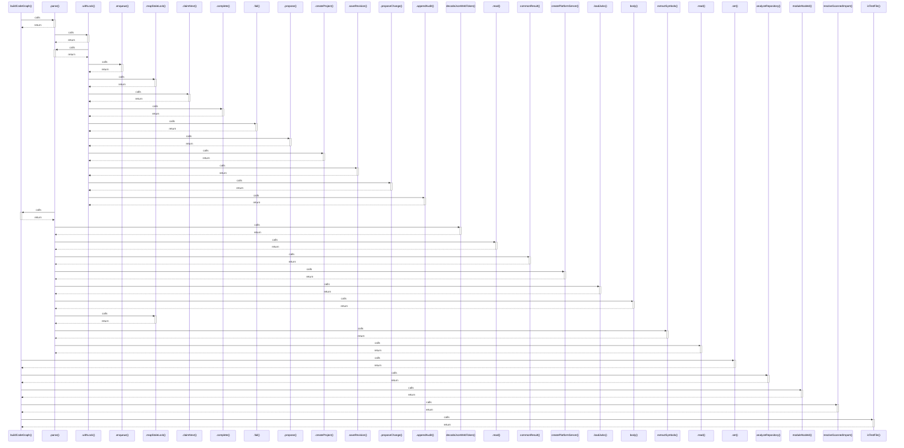

# buildCodeGraph()

> God node · 7 connections · [C:\Users\HabiburRahmanShalin\workstation\shaleen\ApplicationDevelopment\spec-craft\src\code-graph.js](file:///C:/Users/HabiburRahmanShalin/workstation/shaleen/ApplicationDevelopment/spec-craft/src/code-graph.js#L29)

## Call Trace Diagram

## Connections by Relation

### calls
- [[.parse()]] `INFERRED`
- [[.set()]] `INFERRED`
- [[analyzeRepository()]] `INFERRED`
- [[moduleNodeId()]] `EXTRACTED`
- [[resolveScannedImport()]] `EXTRACTED`
- [[isTestFile()]] `EXTRACTED`

### contains
- [[code-graph.js]] `EXTRACTED`

---

*Part of the graphify knowledge wiki. See [[index]] to navigate.*