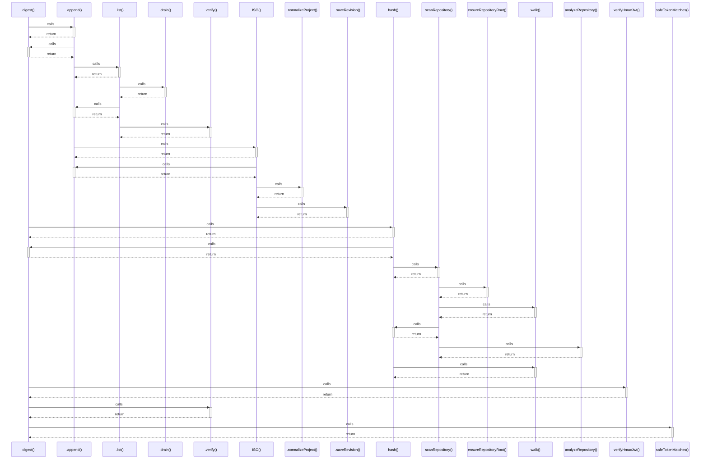

# digest()

> God node · 6 connections · [C:\Users\HabiburRahmanShalin\workstation\shaleen\ApplicationDevelopment\spec-craft\src\production-infrastructure.js](file:///C:/Users/HabiburRahmanShalin/workstation/shaleen/ApplicationDevelopment/spec-craft/src/production-infrastructure.js#L26)

## Call Trace Diagram

## Connections by Relation

### calls
- [[.append()]] `EXTRACTED`
- [[hash()]] `INFERRED`
- [[verifyHmacJwt()]] `EXTRACTED`
- [[.verify()]] `EXTRACTED`
- [[safeTokenMatches()]] `INFERRED`

### contains
- [[production-infrastructure.js]] `EXTRACTED`

---

*Part of the graphify knowledge wiki. See [[index]] to navigate.*