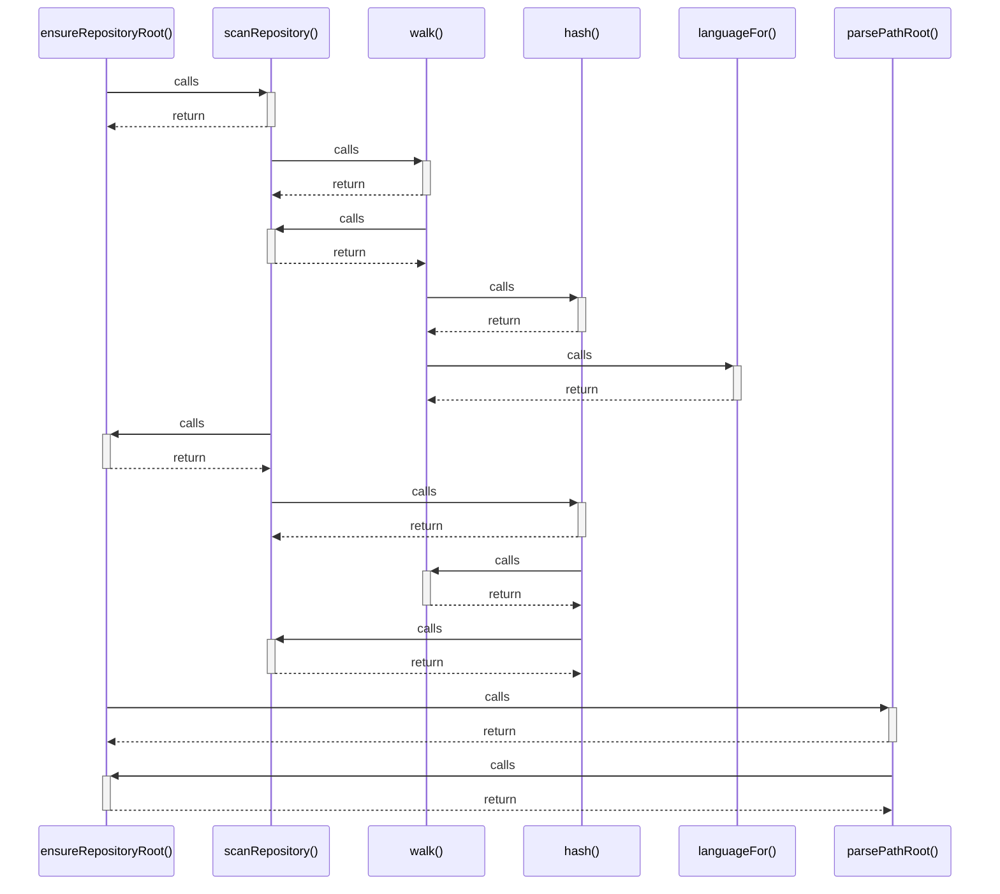

# ensureRepositoryRoot()

> God node · 3 connections · [C:\Users\HabiburRahmanShalin\workstation\shaleen\ApplicationDevelopment\spec-craft\src\repository-platform.js](file:///C:/Users/HabiburRahmanShalin/workstation/shaleen/ApplicationDevelopment/spec-craft/src/repository-platform.js#L11)

## Call Trace Diagram

## Connections by Relation

### calls
- [[scanRepository()]] `EXTRACTED`
- [[parsePathRoot()]] `EXTRACTED`

### contains
- [[repository-platform.js]] `EXTRACTED`

---

*Part of the graphify knowledge wiki. See [[index]] to navigate.*