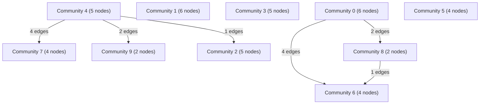

# Knowledge Graph Index

> Auto-generated by graphify. Start here — read community articles for context, then drill into god nodes for detail.

**43 nodes · 49 edges · 10 communities**

---

## System Architecture Flowchart

## Communities
(sorted by size, largest first)

- [[Community 0]] — 6 nodes
- [[Community 1]] — 6 nodes
- [[Community 2]] — 5 nodes
- [[Community 3]] — 5 nodes
- [[Community 4]] — 5 nodes
- [[Community 5]] — 4 nodes
- [[Community 6]] — 4 nodes
- [[Community 7]] — 4 nodes
- [[Community 8]] — 2 nodes
- [[Community 9]] — 2 nodes

## God Nodes
(most connected concepts — the load-bearing abstractions)

- [[walk()]] — 4 connections
- [[scanRepository()]] — 4 connections
- [[requireText()]] — 4 connections
- [[ensureRepositoryRoot()]] — 3 connections
- [[hash()]] — 3 connections
- [[renderProjectSummary()]] — 2 connections
- [[lineNumber()]] — 2 connections
- [[extractSymbols()]] — 2 connections
- [[parsePathRoot()]] — 2 connections
- [[languageFor()]] — 2 connections

---

*Generated by [graphify](https://github.com/safishamsi/graphify)*