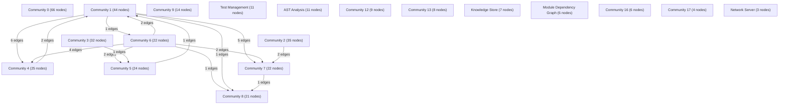

# Knowledge Graph Index

> Auto-generated by graphify. Start here — read community articles for context, then drill into god nodes for detail.

**370 nodes · 452 edges · 19 communities**

---

## System Architecture Flowchart

```mermaid
flowchart TD
    C0["Community 0 (66 nodes)"]
    C1["Community 1 (44 nodes)"]
    C2["Community 2 (35 nodes)"]
    C3["Community 3 (32 nodes)"]
    C4["Community 4 (25 nodes)"]
    C5["Community 5 (24 nodes)"]
    C6["Community 6 (22 nodes)"]
    C7["Community 7 (22 nodes)"]
    C8["Community 8 (21 nodes)"]
    C9["Community 9 (14 nodes)"]
    C10["Test Management (11 nodes)"]
    C11["AST Analysis (11 nodes)"]
    C12["Community 12 (9 nodes)"]
    C13["Community 13 (8 nodes)"]
    C14["Knowledge Store (7 nodes)"]
    C15["Module Dependency Graph (6 nodes)"]
    C16["Community 16 (6 nodes)"]
    C17["Community 17 (4 nodes)"]
    C18["Network Server (3 nodes)"]
    C1 -->|6 edges| C4
    C1 -->|5 edges| C7
    C6 -->|4 edges| C4
    C6 -->|2 edges| C7
    C2 -->|2 edges| C7
    C6 -->|2 edges| C5
    C6 -->|2 edges| C1
    C4 -->|2 edges| C1
    C6 -->|1 edges| C8
    C5 -->|1 edges| C1
    C1 -->|1 edges| C6
    C1 -->|1 edges| C8
    C7 -->|1 edges| C8
    C3 -->|1 edges| C5
```

## Communities
(sorted by size, largest first)

- [[Community 0]] — 66 nodes
- [[Community 1]] — 44 nodes
- [[Community 2]] — 35 nodes
- [[Community 3]] — 32 nodes
- [[Community 4]] — 25 nodes
- [[Community 5]] — 24 nodes
- [[Community 6]] — 22 nodes
- [[Community 7]] — 22 nodes
- [[Community 8]] — 21 nodes
- [[Community 9]] — 14 nodes
- [[Test Management]] — 11 nodes
- [[AST Analysis]] — 11 nodes
- [[Community 12]] — 9 nodes
- [[Community 13]] — 8 nodes
- [[Knowledge Store]] — 7 nodes
- [[Module Dependency Graph]] — 6 nodes
- [[Community 16]] — 6 nodes
- [[Community 17]] — 4 nodes
- [[Network Server]] — 3 nodes

## God Nodes
(most connected concepts — the load-bearing abstractions)

- [[FileJobQueue]] — 10 connections
- [[ProjectRepository]] — 10 connections
- [[ManagedDatabaseAdapter]] — 8 connections
- [[buildCodeGraph()]] — 7 connections
- [[VaultSecretProvider]] — 7 connections
- [[traverseKnowledgeGraph()]] — 6 connections
- [[PlatformAdapter]] — 6 connections
- [[digest()]] — 6 connections
- [[decodeJsonWebToken()]] — 5 connections
- [[DurableAuditLog]] — 5 connections

---

*Generated by [graphify](https://github.com/safishamsi/graphify)*