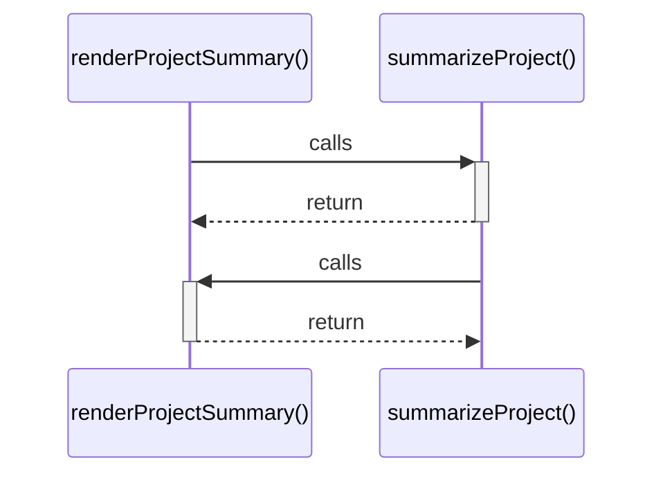

# renderProjectSummary()

> God node · 2 connections · [C:\Users\HabiburRahmanShalin\workstation\shaleen\ApplicationDevelopment\spec-craft\src\app.js](file:///C:/Users/HabiburRahmanShalin/workstation/shaleen/ApplicationDevelopment/spec-craft/src/app.js#L51)

## Call Trace Diagram

## Connections by Relation

### calls
- [[summarizeProject()]] `INFERRED`

### contains
- [[app.js]] `EXTRACTED`

---

*Part of the graphify knowledge wiki. See [[index]] to navigate.*