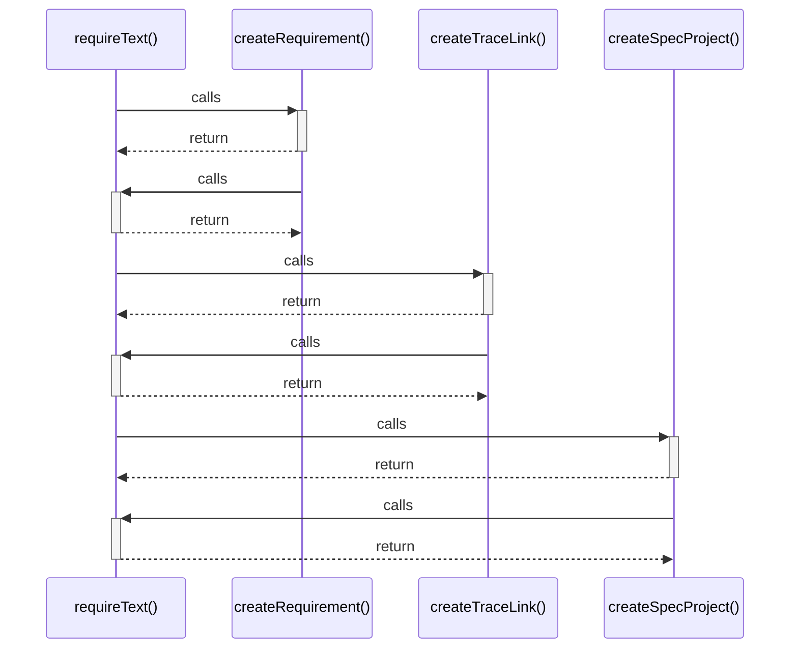

# requireText()

> God node · 4 connections · [C:\Users\HabiburRahmanShalin\workstation\shaleen\ApplicationDevelopment\spec-craft\src\spec-model.js](file:///C:/Users/HabiburRahmanShalin/workstation/shaleen/ApplicationDevelopment/spec-craft/src/spec-model.js#L5)

## Call Trace Diagram

## Connections by Relation

### calls
- [[createRequirement()]] `EXTRACTED`
- [[createTraceLink()]] `EXTRACTED`
- [[createSpecProject()]] `EXTRACTED`

### contains
- [[spec-model.js]] `EXTRACTED`

---

*Part of the graphify knowledge wiki. See [[index]] to navigate.*