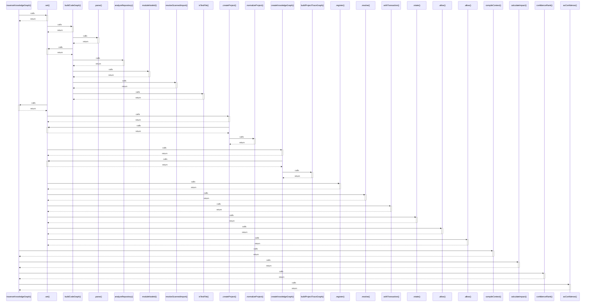

# traverseKnowledgeGraph()

> God node · 6 connections · [C:\Users\HabiburRahmanShalin\workstation\shaleen\ApplicationDevelopment\spec-craft\src\knowledge-graph.js](file:///C:/Users/HabiburRahmanShalin/workstation/shaleen/ApplicationDevelopment/spec-craft/src/knowledge-graph.js#L194)

## Call Trace Diagram

## Connections by Relation

### calls
- [[.set()]] `INFERRED`
- [[compileContext()]] `INFERRED`
- [[calculateImpact()]] `INFERRED`
- [[confidenceRank()]] `EXTRACTED`
- [[asConfidence()]] `EXTRACTED`

### contains
- [[knowledge-graph.js]] `EXTRACTED`

---

*Part of the graphify knowledge wiki. See [[index]] to navigate.*